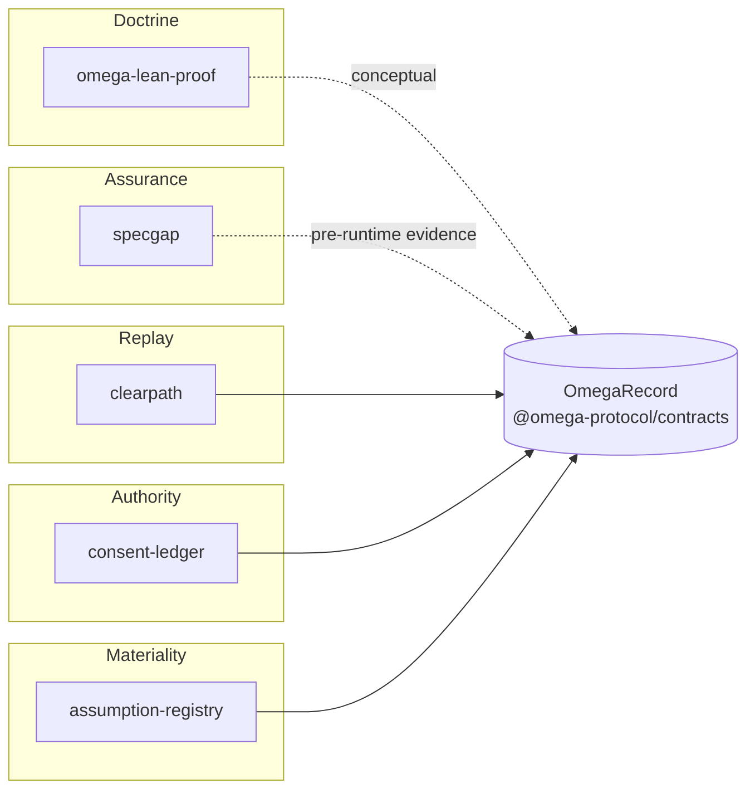

# @omega-protocol/contracts

Canonical interoperability substrate for OMEGA protocol libraries. This package defines the shared TypeScript types, JSON Schemas, canonical encoding helpers, fixtures, test vector, adapter contract, and conformance runner used by the OMEGA protocol stack. It is not a runtime, router, engine, service, or implementation of any protocol's native logic.

**This package validates governed evidence records; it does not decide whether an action should proceed.**

## Position in OMEGA Lab

Public lab entry: [github.com/repowazdogz-droid/repowazdogz-droid](https://github.com/repowazdogz-droid/repowazdogz-droid)

**Sibling adapters shipped today:** [clearpath](https://github.com/repowazdogz-droid/clearpath), [consent-ledger](https://github.com/repowazdogz-droid/consent-ledger), [assumption-registry](https://github.com/repowazdogz-droid/assumption-registry) — see [docs/TRUST_STACK.md](./docs/TRUST_STACK.md).

| Doc | Purpose |
| --- | --- |
| [docs/TRUST_STACK.md](./docs/TRUST_STACK.md) | How sibling repos map into `OmegaRecord` |
| [docs/PRIMITIVE_MAP.md](./docs/PRIMITIVE_MAP.md) | Primitive → field → honest implementation status |
| [docs/ASSURANCE_BOUNDARY.md](./docs/ASSURANCE_BOUNDARY.md) | Guarantees, non-guarantees, TCB, failure modes |



**A valid `OmegaRecord` proves record conformance, not real-world correctness.**

## Installation

```bash
npm install @omega-protocol/contracts
```

## Quick Example

```typescript
import type { ClearpathSummary, OmegaRecord } from '@omega-protocol/contracts';

const clearpath: ClearpathSummary = {
  total_traces: 1,
  verification_failures: 0,
  assumption_ratio: 0.5,
  alternatives_considered_avg: 3,
  faithfulness_distribution: {
    verified_faithful: 1,
    narrative: 0,
    unverified: 0,
    disputed: 0,
  },
  availability: {
    assumption_ratio: 'available',
    alternatives_considered_avg: 'available',
  },
};

const record: OmegaRecord = {
  record_id: '01HZX1F8Q7M5VK2N9P3R6S8T4Y',
  schema_version: 'omega/1.0',
  contracts_version: '0.2.2',
  created_at: '2026-05-03T12:00:00Z',
  subject: {
    domain: 'clinical.spine',
    action: 'Recommend physiotherapy over fusion',
    actor_id: 'dr_smith_001',
    stakes: 'moderate',
  },
  clearpath,
  outcome: {
    gate_result: 'COMMITTED',
    gate_reason: 'Canonical example only',
    acted: true,
  },
  previous_hash: null,
  content_hash: '0'.repeat(64),
};
```

## Conformance Levels

- `C0` — Schema conformant: TypeScript and exported types match the contracts package.
- `C1` — Adapter conformant: native fixture round-trip, schema validation, determinism, fingerprint stability, and availability behavior.
- `C2` — Composition conformant: adapter output integrates into an `OmegaRecord` without massaging.
- `C3` — Integrity conformant: no adapter timestamps, derived-field provenance, and content hash reproducibility.

Run conformance checks:

```bash
npx omega-contracts-conformance <library-path> --level C3
```

## Schemas And Fixtures

JSON Schemas in `schemas/` are the cross-language source of truth. Fixtures in `fixtures/` include per-library canonical examples and a composition test vector.

Locked test vector hash:

```text
152eab926412e397dfdd56217dad03a924bc9c138bee2ceafa2f3200c3d2c705
```

## Specification

Normative shapes and composition rules live in this repository (`schemas/`, `src/`, `docs/`). Narrative specification and formal proof context: [omegaprotocol.org](https://omegaprotocol.org) · [contracts homepage](https://omegaprotocol.org/contracts/).

## License

MIT
